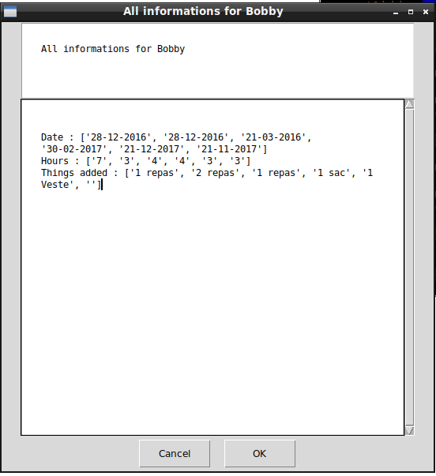

# Childcare Time

## What's Childcare Time?

Childcare Time is a software that give you the possibility to manage your a Childcare Time. (Hours, Date, Additional Stuff)  





## Exemple :

This week you keep one child 4 hours, give 3 meals and the day was the 10-11-2017.  

## What you need to make it work :

This game is made for Python 3.  

Install all the packages for : Python 3.  

easygui at least version 0.98  

```sh
sudo python3 -m pip install --upgrade easygui  
```  

## How to launch the game :

```sh
python3 ChildcareTime.py
```


## Developer - Author

Hamdy Abou El Anein

